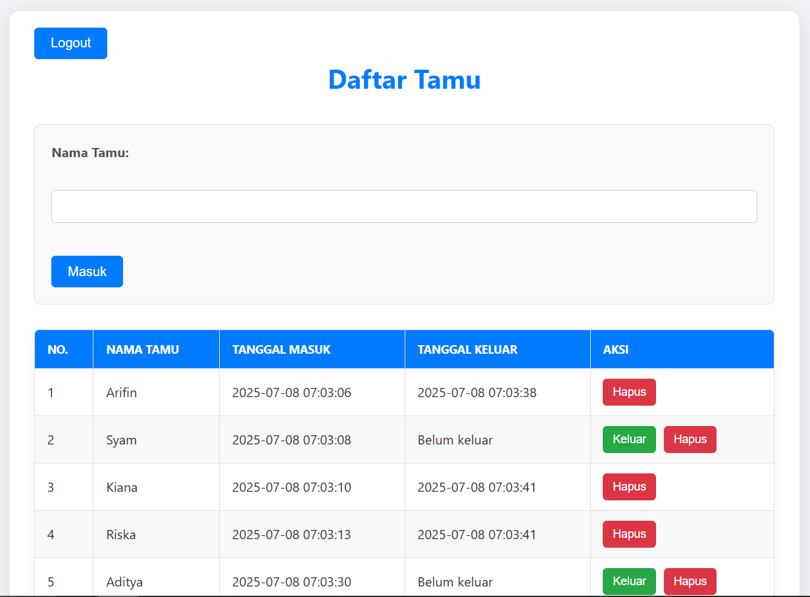

# 📝 Aplikasi Buku Daftar Tamu Sederhana



## Deskripsi Aplikasi

Aplikasi Buku Daftar Tamu ini adalah sebuah sistem berbasis web sederhana yang dibangun menggunakan PHP. Aplikasi ini dirancang untuk membantu pencatatan tamu yang datang ke suatu acara atau lokasi, memungkinkan pengguna untuk mencatat kedatangan, menandai keberangkatan, dan mengelola entri tamu dengan mudah. Dilengkapi dengan sistem login dasar untuk menjaga keamanan akses.

## ✨ Fitur Utama

-   **Sistem Login:** Akses aplikasi diamankan dengan kredensial login sederhana (default: `admin`/`admin`).
-   **Pencatatan Tamu:** Tambahkan nama tamu beserta waktu kedatangan mereka secara otomatis.
-   **Penandaan Keberangkatan:** Tandai tamu yang sudah meninggalkan acara dengan mencatat waktu keberangkatan mereka.
-   **Penghapusan Entri:** Hapus entri tamu yang tidak diperlukan dari daftar.
-   **Manajemen Sesi:** Data tamu disimpan dalam sesi, memastikan data tetap ada selama sesi pengguna aktif.

## 🚀 Teknologi yang Digunakan

-   **PHP:** Sebagai bahasa pemrograman sisi server untuk logika aplikasi dan manajemen sesi.
-   **HTML:** Untuk struktur halaman web.
-   **CSS:** Untuk styling dasar antarmuka pengguna.

## 📋 Syarat (Prasyarat)

Untuk menjalankan aplikasi ini, Anda memerlukan lingkungan server web yang mendukung PHP. Contohnya:

-   **Server Web:** Apache, Nginx, atau sejenisnya.
-   **PHP:** Versi 5.6 atau lebih tinggi (disarankan PHP 7.x atau lebih baru).

## 🛠️ Setup Awal / Instalasi

Ikuti langkah-langkah berikut untuk mengatur dan menjalankan aplikasi di lingkungan lokal Anda:

1.  **Kloning Repositori:**
    ```bash
    git clone <URL_REPOSITORI_ANDA>
    cd daftar-tamu
    ```

2.  **Tempatkan File di Direktori Server Web:**
    *   Salin seluruh folder `daftar-tamu` ke dalam direktori root server web Anda (misalnya, `htdocs` untuk XAMPP, `www` untuk WAMP, atau `public_html` untuk server produksi).

3.  **Akses Aplikasi melalui Browser:**
    *   Buka browser Anda dan navigasikan ke `http://localhost/daftar-tamu` (sesuaikan jika nama folder atau port server Anda berbeda).

4.  **Kredensial Login Default:**
    *   **Username:** `admin`
    *   **Password:** `admin`

## 💡 Potensi Pengembangan Lebih Lanjut

-   **Integrasi Database:** Ganti penyimpanan sesi dengan database (misalnya MySQL, PostgreSQL) untuk persistensi data yang lebih baik dan skalabilitas.
-   **Antarmuka Pengguna yang Lebih Baik:** Tingkatkan tampilan dengan framework CSS modern (seperti Bootstrap, Tailwind CSS) atau JavaScript untuk pengalaman pengguna yang lebih interaktif.
-   **Fitur Pencarian/Filter:** Tambahkan kemampuan untuk mencari atau memfilter daftar tamu berdasarkan kriteria tertentu.
-   **Export Data:** Implementasikan fitur untuk mengekspor daftar tamu ke format CSV atau PDF.
-   **Manajemen Pengguna:** Kembangkan fitur untuk menambah, mengedit, atau menghapus pengguna, serta manajemen peran (misalnya, admin, operator).
-   **Validasi Input:** Tambahkan validasi sisi server dan klien untuk input data.
-   **Keamanan:** Tingkatkan keamanan dengan hashing password, mencegah SQL Injection (jika menggunakan DB), dan XSS.
