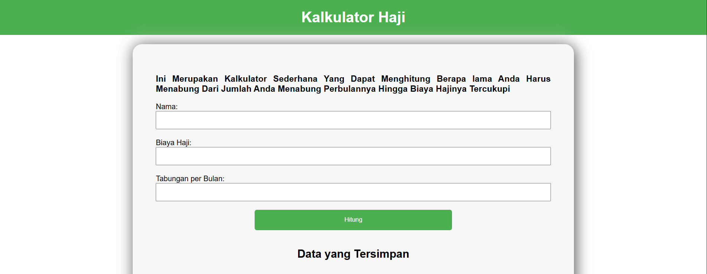

# 🕋 Kalkulator Haji



## Deskripsi Aplikasi

Aplikasi Kalkulator Haji adalah sebuah alat berbasis web sederhana yang dirancang untuk membantu pengguna memperkirakan berapa lama waktu yang dibutuhkan untuk menunaikan ibadah haji. Perhitungan didasarkan pada harga haji saat ini dan jumlah tabungan bulanan yang dapat disisihkan oleh pengguna. Aplikasi ini juga dilengkapi dengan fitur penyimpanan data perhitungan untuk referensi di masa mendatang.

## ✨ Fitur Utama

-   **Perhitungan Estimasi Haji:** Menghitung perkiraan lama menabung (dalam bulan/tahun) yang diperlukan untuk mencapai biaya haji.
-   **Penyimpanan Data:** Menyimpan data perhitungan yang telah dilakukan ke dalam database.
-   **Daftar Perhitungan:** Menampilkan daftar riwayat perhitungan yang tersimpan.
-   **Penghapusan Data:** Memungkinkan pengguna untuk menghapus data perhitungan yang tidak lagi diperlukan.

## 🚀 Teknologi yang Digunakan

-   **PHP:** Sebagai bahasa pemrograman sisi server untuk logika aplikasi dan interaksi database.
-   **MySQL/MariaDB:** Sebagai sistem manajemen database untuk menyimpan data perhitungan.
-   **HTML:** Untuk struktur halaman web.
-   **CSS:** Untuk styling dasar antarmuka pengguna.

## 📋 Syarat (Prasyarat)

Untuk menjalankan aplikasi ini, Anda memerlukan lingkungan server web dengan dukungan PHP dan database MySQL/MariaDB. Contohnya:

-   **Server Web:** Apache, Nginx, atau PHP built-in server.
-   **PHP:** Versi 7.4 atau lebih tinggi disarankan.
-   **Database:** MySQL atau MariaDB.

## 🛠️ Setup Awal / Instalasi

Ikuti langkah-langkah di bawah ini untuk mengatur dan menjalankan proyek ini di lingkungan lokal Anda:

1.  **Clone Repositori:**
    ```bash
    git clone <URL_REPOSITORI_ANDA>
    cd kalkulator_haji
    ```

2.  **Konfigurasi Database:**
    *   Buat database baru di MySQL/MariaDB Anda (misalnya menggunakan phpMyAdmin atau klien database lainnya).
    *   Jalankan query SQL berikut untuk membuat database dan tabel yang diperlukan:
        ```sql
        CREATE DATABASE IF NOT EXISTS haji_tabungan;
        USE haji_tabungan;

        CREATE TABLE IF NOT EXISTS haji (
            id INT AUTO_INCREMENT PRIMARY KEY,
            nama VARCHAR(100),
            harga_haji DECIMAL(10,2),
            tabungan_perbulan DECIMAL(10,2),
            lama_menabung INT
        );
        ```

3.  **Konfigurasi Koneksi Database:**
    *   Buka file `koneksi.php` dan sesuaikan kredensial database Anda (nama pengguna, kata sandi, nama database) jika diperlukan:
        ```php
        <?php
        $servername = "localhost";
        $username = "root"; // Ganti dengan username database Anda
        $password = "";     // Ganti dengan password database Anda
        $dbname = "haji_tabungan";

        // Buat koneksi
        $conn = new mysqli($servername, $username, $password, $dbname);

        // Cek koneksi
        if ($conn->connect_error) {
            die("Koneksi gagal: " . $conn->connect_error);
        }
        ?>
        ```

4.  **Jalankan Aplikasi:**
    *   Tempatkan folder `kalkulator_haji` di direktori root web server Anda (misalnya, `htdocs` untuk Apache, `www` untuk Nginx).
    *   Atau, Anda bisa menggunakan PHP built-in server dari direktori proyek:
        ```bash
        php -S localhost:8000
        ```
    *   Kemudian, buka browser Anda dan navigasikan ke:
        ```
        http://localhost/kalkulator_haji
        ```
        atau jika menggunakan PHP built-in server:
        ```
        http://localhost:8000
        ```

## 💡 Potensi Pengembangan Lebih Lanjut

-   **Antarmuka Pengguna yang Lebih Modern:** Tingkatkan tampilan dan pengalaman pengguna dengan framework CSS (misalnya Bootstrap, Tailwind CSS) atau JavaScript.
-   **Validasi Input:** Tambahkan validasi sisi klien dan sisi server yang lebih robust untuk input pengguna.
-   **Fitur Laporan:** Buat laporan atau grafik visualisasi dari data perhitungan yang tersimpan.
-   **Manajemen Pengguna:** Implementasikan sistem pengguna untuk memungkinkan setiap pengguna memiliki riwayat perhitungan mereka sendiri.
-   **Integrasi API:** Jika memungkinkan, integrasikan dengan API eksternal untuk mendapatkan harga haji terkini secara otomatis.
-   **Notifikasi:** Tambahkan fitur notifikasi (misalnya email) untuk mengingatkan pengguna tentang progres tabungan mereka.
