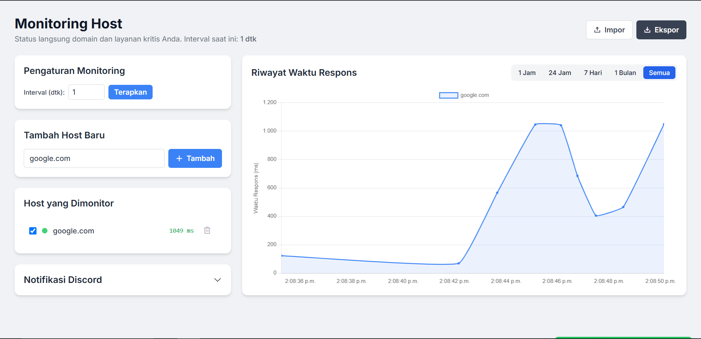
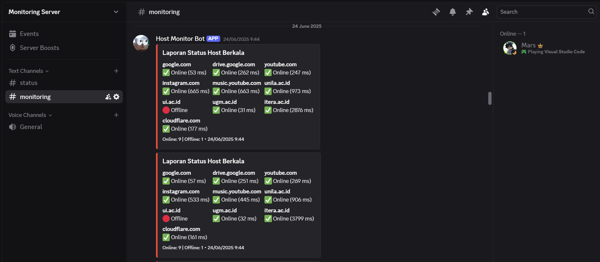

# 🖥️ Dashboard Monitoring Host Real-time




## Deskripsi Aplikasi

Aplikasi Dashboard Monitoring Host Real-time adalah sebuah antarmuka web yang memungkinkan pengguna untuk memantau status ketersediaan (online/offline) dan waktu respons dari berbagai host (domain atau alamat IP) secara terus-menerus. Aplikasi ini menyediakan visualisasi data historis dalam bentuk grafik dan mendukung notifikasi Discord untuk perubahan status host serta laporan berkala. Data monitoring disimpan secara lokal di browser pengguna.

## ✨ Fitur Utama

-   **Monitoring Real-time:** Memantau status online/offline dan waktu respons host dengan interval yang dapat dikonfigurasi.
-   **Manajemen Host:** Menambah dan menghapus host yang ingin dimonitor.
-   **Visualisasi Grafik:** Menampilkan riwayat waktu respons host dalam grafik interaktif menggunakan Chart.js, dengan filter waktu (1 jam, 24 jam, 7 hari, 1 bulan, semua).
-   **Notifikasi Discord:** Mengirim notifikasi ke Discord webhook saat status host berubah (online/offline) dan laporan status berkala.
-   **Penyimpanan Lokal:** Menyimpan data host, riwayat monitoring, dan pengaturan webhook secara lokal di browser (menggunakan Local Storage).
-   **Import/Export Data:** Memungkinkan pengguna untuk mengimpor dan mengekspor data monitoring dalam format JSON.
-   **Pengaturan Interval:** Mengubah frekuensi pengecekan host.
-   **Antarmuka Responsif:** Desain yang menyesuaikan untuk berbagai ukuran layar.

## 🚀 Teknologi yang Digunakan

-   **HTML:** Struktur dasar halaman web.
-   **CSS:** Styling antarmuka pengguna, termasuk penggunaan Tailwind CSS (melalui CDN) untuk desain modern.
-   **JavaScript:** Logika inti aplikasi, monitoring host, manajemen data, interaksi UI, dan integrasi Chart.js.
-   **Chart.js:** Library JavaScript untuk membuat grafik data respons host.
-   **Chart.js Adapter Date-Fns:** Adapter untuk Chart.js yang memungkinkan penanganan data waktu dengan mudah.
-   **Phosphor Icons:** Library ikon untuk elemen UI.

## 📋 Syarat (Prasyarat)

Untuk menjalankan aplikasi ini, Anda hanya memerlukan browser web modern yang mendukung JavaScript dan Local Storage. Tidak ada server backend yang diperlukan karena semua operasi dilakukan di sisi klien.

## 🛠️ Setup Awal / Instalasi

Ikuti langkah-langkah berikut untuk menggunakan aplikasi ini:

1.  **Kloning Repositori:**
    ```bash
    git clone <URL_REPOSITORI_ANDA>
    cd monitoring-host
    ```

2.  **Buka File `index.html`:**
    *   Cukup buka file `index.html` di browser web Anda. Anda bisa melakukannya dengan mengklik dua kali file tersebut atau menyeretnya ke jendela browser.
    *   Atau, jika Anda memiliki server web lokal (misalnya Apache, Nginx, XAMPP), Anda bisa menempatkan folder `monitoring-host` di direktori root server web Anda dan mengaksesnya melalui `http://localhost/monitoring-host`.

3.  **Konfigurasi Awal:**
    *   Setelah aplikasi terbuka, Anda dapat mulai menambahkan host yang ingin dimonitor.
    *   Untuk notifikasi Discord, masukkan URL webhook Anda di bagian "Notifikasi Discord" dan simpan pengaturannya.

## 💡 Potensi Pengembangan Lebih Lanjut

-   **Backend Server:** Implementasikan backend server (misalnya Node.js, Python, PHP) untuk:
    -   Penyimpanan data yang persisten (database) daripada Local Storage.
    -   Melakukan pengecekan host dari sisi server untuk menghindari batasan CORS dan pemblokiran IP klien.
    -   Manajemen pengguna dan otentikasi.
-   **Notifikasi Tambahan:** Integrasikan dengan layanan notifikasi lain seperti email, SMS, Slack, atau Telegram.
-   **Fitur Laporan Lanjutan:** Buat laporan uptime, rata-rata waktu respons, atau insiden host.
-   **Deteksi Insiden:** Implementasikan logika yang lebih canggih untuk mendeteksi dan mengklasifikasikan insiden (misalnya, penurunan performa, bukan hanya offline).
-   **Tampilan Dashboard:** Tingkatkan tampilan dashboard dengan widget yang dapat disesuaikan, ringkasan status, dan metrik kunci.
-   **Peringatan Kustom:** Izinkan pengguna untuk mengatur ambang batas waktu respons atau kondisi lain untuk memicu peringatan.
-   **Integrasi API:** Jika ada, integrasikan dengan API penyedia layanan hosting atau domain untuk informasi tambahan.
-   **PWA (Progressive Web App):** Jadikan aplikasi dapat diinstal dan berjalan secara offline.
-   **Unit Testing:** Tambahkan unit dan integrasi tes untuk memastikan fungsionalitas yang stabil.
