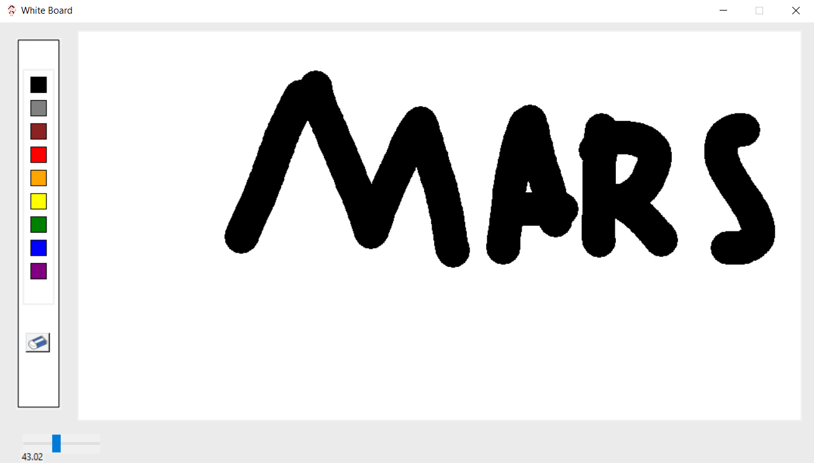

# 🎨 White Board Python - Papan Tulis Digital Sederhana



## Deskripsi Aplikasi

White Board Python adalah aplikasi papan tulis digital sederhana yang dibangun menggunakan pustaka Tkinter di Python. Aplikasi ini memungkinkan pengguna untuk menggambar bebas di kanvas, memilih berbagai warna, mengatur ketebalan garis, dan menghapus seluruh gambar untuk memulai dari awal. Ini adalah alat yang ideal untuk sketsa cepat, catatan visual, atau sekadar berkreasi secara digital.

## ✨ Fitur Utama

-   **Menggambar Bebas:** Gunakan mouse untuk menggambar garis di kanvas.
-   **Pilihan Warna:** Tersedia palet warna dasar (hitam, abu-abu, coklat, merah, oranye, kuning, hijau, biru, ungu) untuk menggambar.
-   **Pengaturan Ketebalan Garis:** Sesuaikan ketebalan garis menggunakan slider untuk variasi goresan.
-   **Fungsi Penghapus:** Hapus seluruh isi kanvas dengan mudah untuk memulai sesi baru.
-   **Antarmuka Pengguna Intuitif:** Desain yang sederhana dan mudah digunakan.

## 🚀 Teknologi yang Digunakan

-   **Python:** Bahasa pemrograman utama.
-   **Tkinter:** Pustaka standar Python untuk membuat antarmuka pengguna grafis (GUI).

## 📋 Syarat (Prasyarat)

Untuk menjalankan aplikasi ini, Anda hanya memerlukan:

-   **Python 3.x:** Pastikan Python terinstal di sistem Anda. Tkinter biasanya sudah termasuk dalam instalasi standar Python.

## 🛠️ Setup Awal / Instalasi

Ikuti langkah-langkah di bawah ini untuk mengatur dan menjalankan proyek ini di lingkungan lokal Anda:

1.  **Clone Repositori:**
    ```bash
    git clone <URL_REPOSITORI_ANDA>
    cd white-board-py
    ```

2.  **Pastikan File Gambar Ada:**
    *   Pastikan file gambar `logo.png`, `color section.png`, dan `eraser.png` berada di direktori yang sama dengan `White_Board.py`.

3.  **Jalankan Aplikasi:**
    *   Buka terminal atau command prompt di direktori proyek.
    *   Jalankan skrip Python:
        ```bash
        python White_Board.py
        ```

## 💡 Potensi Pengembangan Lebih Lanjut

-   **Alat Gambar Tambahan:** Tambahkan alat seperti bentuk (persegi, lingkaran), teks, atau alat pengisi warna.
-   **Penyimpanan/Pembukaan Gambar:** Fitur untuk menyimpan gambar yang dibuat (misalnya dalam format PNG) dan membukanya kembali.
-   **Undo/Redo:** Implementasikan fungsionalitas undo dan redo untuk koreksi kesalahan.
-   **Palet Warna Kustom:** Izinkan pengguna untuk memilih warna kustom menggunakan color picker.
-   **Integrasi Gambar:** Kemampuan untuk mengimpor gambar ke kanvas.
-   **Mode Gelap/Terang:** Opsi tema untuk antarmuka aplikasi.
-   **Peningkatan Performa:** Optimasi untuk penanganan gambar yang lebih besar atau goresan yang lebih kompleks.
